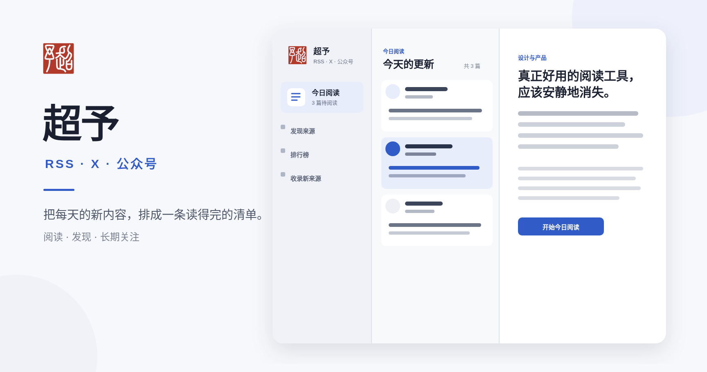

# 大白话工作室 (Dabaihua Studio)

一个可自行部署的阅读、心结与内容发现工作台。它聚合 RSS、X 与微信公众号，也把反复出现的个人问题记录为心结，供 Agent、CLI 和后续内容工作流持续炼化。



## 功能

- 聚合 RSS、X 作者和微信公众号内容
- 今日阅读流、预计阅读时间、已读和收藏状态
- 来源发现、关注、取消关注和导入队列
- 文章批注、回复、通知与个人主页
- 心结捕捉、再次触发、材料关联、探索研究和候选方向确认
- D1 持久化和 R2 媒体存储
- 可选的 Cloudflare Workers AI 中文处理
- Cloudflare Worker 定时同步 RSS 与 X
- 可选的本机微信公众号采集流程

## 技术栈

- Next.js 16、React 19、TypeScript
- vinext、Vite、Cloudflare Workers
- Drizzle ORM、Cloudflare D1、R2

## 本地运行

需要 Node.js `>=22.13.0`。

```bash
git clone https://github.com/GalaxyXieyu/dabaihua-studio.git
cd dabaihua-studio
npm install
npm run dev
```

本地开发会使用项目配置的本地 D1。首次打开时注册一个账号即可使用。仓库不包含任何生产用户数据、第三方文章正文或微信公众号图片。

没有 AI 绑定时，RSS 收集、中文内容、收藏和批注仍可工作；需要翻译的外文条目会保留原文并等待处理。

## 手机审稿页 (/review/[id])

选题生成草稿后，可以在手机上完成审稿：

```bash
npm run draft -- <id>
```

然后打开 `/review/<id>`（需先登录）。逐段阅读草稿，点段落即可添加批注；底部操作栏可以「通过」或「打回」——打回必须填写意见，结果会记录在审稿历史里。选题看板中带草稿的卡片会显示「📝 审稿」入口，以及最新的审稿状态。

### 生产模式与部署

本地验证生产构建（Cloudflare Worker 产物）时，用生产模式脚本启动：

```bash
npm run build && npm run prod:start
```

- 默认监听 `3100` 端口，可用 `PORT` 和 `HOST` 环境变量覆盖（如 `PORT=3101 HOST=127.0.0.1 npm run prod:start`）。
- `npm run prod:status` 查看运行状态（running/stopped + pid + 端口），`npm run prod:stop` 停止。
- 脚本依据 `dist/server/wrangler.json` 运行；若该文件不存在或设置 `BUILD=1`，会自动先执行 `npm run build`。
- 日志写入 `.wrangler/prod/server.log`（wrangler 自身日志在 `.wrangler/prod/wrangler.log`），pid 记录在 `.wrangler/prod/server.pid`。
- 使用 `--persist-to .wrangler/state`，与 `npm run dev` 共享同一份本地 D1 数据；两者不能同时占用同一端口，但数据互通。
- 手机审稿需先登录，未登录访问 `/review/<id>` 会跳到 `/login?next=/review/<id>`，登录后回到原页面。

如果要让手机通过公网 HTTPS 访问，使用 nginx 反向代理 `deploy/nginx/review.aigalaxy.top.conf`：

```bash
sudo cp deploy/nginx/review.aigalaxy.top.conf /etc/nginx/sites-available/
sudo ln -s /etc/nginx/sites-available/review.aigalaxy.top.conf /etc/nginx/sites-enabled/
sudo mkdir -p /var/www/certbot
sudo certbot --nginx -d review.aigalaxy.top
sudo nginx -t && sudo systemctl reload nginx
```

注意：`review.aigalaxy.top` 的 DNS **目前尚未配置**。需要先确认该域名的 DNS 服务商，并添加一条指向本机公网 IP 的 A 记录，certbot 的 HTTP-01 校验才能通过。生产环境务必通过 HTTPS 访问；会话 Cookie 在非 localhost 主机上会自动带上 `Secure` 标记，只应经 HTTPS 传输。

## 验证

```bash
npm run lint
npm test
npm run db:generate
```

`npm test` 会先执行生产构建，再运行项目测试。

## 部署

项目面向 Cloudflare Workers 运行时，并在 `.openai/hosting.json` 中声明以下逻辑绑定：

- `DB`：Cloudflare D1 数据库
- `MEDIA`：Cloudflare R2 存储桶
- `AI`：可选的 Workers AI binding

部署自己的副本时，请创建独立的 D1 和 R2 资源，不要复用他人的项目标识或生产数据。数据库结构位于 `db/schema.ts`，迁移位于 `drizzle/`。

远程导入接口使用 `IMPORT_TOKEN` 保护。请在托管平台生成高强度随机值并作为 secret 配置，不要提交到 Git。`.env.example` 只列出变量名称和示例。

## 每日 AI 素材 (daily-ai-digest)

`npm run digest` 会抓取 GitHub、Hacker News、厂商博客 RSS 与本地 D1 里的近几日文章，
调用 `pi` CLI 过滤并生成 6-10 条中文干货和 3-5 个公众号选题，写出 markdown 到
`DIGEST_OUT_DIR`（默认 `/workspace/projects/daily-topics/<日期>.md`），并把选题以
`candidate` 状态写入本地 D1 的 `topics` 板。

```bash
export PATH=/home/box/.local/bin:$PATH   # node 22 + pi
export OPENCODE_API_KEY=...              # 来自你的密钥库，切勿提交
npm run digest
# 或：node scripts/daily-ai-digest.mjs [--refresh] [--force] [--dry-run] [--no-board] [--date YYYY-MM-DD]
```

- `--refresh`：忽略当日缓存，重新抓取并调用模型
- `--force`：即使当日已有写入记录，也强制写入选题板
- `--dry-run`：不写文件、不写库，直接打印 markdown
- `--no-board`：只写 markdown，跳过选题板
- `--date YYYY-MM-DD`：指定日期（默认 Asia/Shanghai 今天）

可选环境变量：`DIGEST_MODEL`、`PI_BIN`、`DIGEST_OUT_DIR`、`DIGEST_D1_PATH`、`GITHUB_TOKEN`。
同一日期重复运行会复用 `.cache/<日期>.json`，因此重跑是幂等的。

## 选题写稿 (draft-article)

`npm run draft -- <选题ID>` 读取本地 D1 中已 `approved` 的选题，抓取选题 notes/angle 里的来源材料，
再用 `pi` CLI 依次执行定位、主稿、去 AI 味、发布前质检四个 Skill 阶段，写出终稿到
`DRAFT_OUT_DIR`（默认 `/workspace/projects/drafts/<日期>-<选题ID>.md`），并把正文回写 `topics.draft_markdown`。

```bash
export PATH=/home/box/.local/bin:$PATH   # node 22 + pi
export OPENCODE_API_KEY=...              # 来自你的密钥库，切勿提交
npm run draft -- 42
# 或：node scripts/draft-article.mjs <topic-id> [--any-status] [--force] [--date YYYY-MM-DD]
```

- `--any-status`：跳过「必须 approved」的状态门槛（不会修改选题状态）
- `--force`：即使已有草稿也强制重新生成；若该选题存在未处理的审稿反馈（最新打回意见 + 未解决批注），会把反馈带入 writer / editor / qa 阶段逐条回应，并在保存新稿后把已处理批注标记为 resolved、把 `review_status` 重置为 `pending` 等待复审
- `--date YYYY-MM-DD`：指定日期（默认 Asia/Shanghai 今天）

可选环境变量：`DRAFT_MODEL`、`PI_BIN`、`DRAFT_OUT_DIR`、`DIGEST_D1_PATH`、`GITHUB_TOKEN`。
中间产物（定位、初稿、修改稿、QA 报告、审稿反馈）保存在 `DRAFT_OUT_DIR/.work/<日期>-<选题ID>/`。

## 公众号 HTML 与草稿箱 (publish-draft)

`npm run publish:draft -- <选题ID>` 读取本地 D1 中已审稿通过的选题终稿，用 `pi` CLI 依次执行
`wechat-article-publisher` 的 mobile-layout（手机端语意分行）与 render（主题渲染）两个阶段，
产出公众号正文 HTML 片段与可复制预览页，并把状态回写 `topics.publish_*`。

```bash
export PATH=/home/box/.local/bin:$PATH   # node 22 + pi
export OPENCODE_API_KEY=...              # 来自你的密钥库，切勿提交
npm run publish:draft -- 42
# 或：node scripts/publish-draft.mjs <topic-id> [--any-review] [--theme <id>] [--upload] [--cover <url>] [--author <name>] [--list-tools] [--force] [--date YYYY-MM-DD]
```

- `--any-review`：跳过「审稿必须 approved」的门槛（不会修改审稿或选题状态）
- `--theme <id>`：排版主题，默认 `red-white`（深度分析/观点）；可用主题见 `.agents/skills/wechat-article-publisher/references/theme-index.md`
- `--upload`：显式上传到公众号草稿箱（外部写操作，需要作者确认）
- `--cover <url>`：草稿封面图 URL（微信草稿必须有封面）
- `--author <name>`：作者名（也可用 `WENYAN_AUTHOR`）
- `--list-tools`：只读列出 wenyan-mcp 的工具与参数 schema，然后退出
- `--force`：即使已有 `html_ready`/`draft_saved` 也重新排版
- `--date YYYY-MM-DD`：指定日期（默认 Asia/Shanghai 今天）

输出：`DRAFT_OUT_DIR`（默认 `/workspace/projects/drafts`）下的 `<日期>-<选题ID>.html`（正文片段）与
`<日期>-<选题ID>_预览.html`（可复制预览）；中间产物在 `.work/<日期>-<选题ID>-publish/`，
其中 `05-validation.md` 汇总 layout / render / HTML 合规校验结果。

可选环境变量：`PUBLISH_MODEL`、`PI_BIN`、`DRAFT_OUT_DIR`、`DIGEST_D1_PATH`、
`DABAIHUA_WENYAN_API_KEY`、`DABAIHUA_WENYAN_MCP_URL`、`WENYAN_THEME`、`WENYAN_AUTHOR`。

**安全边界**：本流水线最多只会把文章存进公众号「草稿箱」，不接受、也不会调用任何群发/发布类工具。
上传工具名有固定白名单（`gzh_article_publish`、`publish_article`），并叠加禁止名单正则
（`mass`、`freepublish`、`submit`、`broadcast`、`群发` 等）；命中即中止。上传必须由作者显式加 `--upload`。

上传需要你先准备：

- `DABAIHUA_WENYAN_API_KEY`：项目级 `wenyan-mcp` 服务的 API Key（服务器地址见 `.mcp.example.json`，
  默认 `http://120.76.159.103:39000/mcp`）。只从环境变量读取，脚本绝不打印。
- 一个封面图 URL（`--cover`）。没有封面时微信草稿无法保存，wenyan 会退回用正文第一张图；
  本流水线正文没有图片，因此上传会失败。
- 服务器端已配置公众号 AppID/Secret 和 IP 白名单（否则远端调用会 401 或失败）。

上传成功后到公众号后台「草稿箱」检查，再自己点击发布。Agent 不会替你发布。

## 数据与版权

本仓库只提供软件代码，不附带抓取的文章正文、用户数据或第三方媒体。使用者需要自行确认订阅、存储和展示内容的合法性，并遵守内容来源的服务条款和版权要求。

## License

[MIT](LICENSE)

## topics CLI（多端命令行客户端）

在任何电脑读取订阅流、心结与选题库：

```bash
curl -fsSL https://raw.githubusercontent.com/GalaxyXieyu/dabaihua-studio/main/public/cli/topics -o ~/bin/topics && chmod +x ~/bin/topics
topics login        # 账号密码换本机 API Key（密码不落盘）；或 topics login --token topk_xxx
topics inbox        # 统一收件箱；topics open <id> 阅读全文（默认标记已读）
topics sources      # 订阅源总览；topics sources set <id> --interval 30m 调整每源拉取间隔
topics sub <RSS地址|X主页|公众号文章链接> --category ai   # 一条命令添加订阅
topics sub <公众号名>                                     # 按名字提交，采集端自动处理
topics unsub <id>   # 取消关注；--delete 删除自己贡献的源
topics imports      # 公众号导入队列进度
topics itch "Agent时代灵感枯竭怎么办"  # 记录心结；再次输入会累计触发
topics itch list                          # 查看开放心结
topics itch show <id>                     # 查看触发历史与关联
topics itch feel <id> "今天为什么又想到它"
topics itch link <id> --item <文章ID>     # 关联阅读材料
topics itch refine <id> --file exploration.json
topics itch research <id> --exploration <探索ID> --file research.json
topics itch direction <id> --file direction.json  # 只创建 candidate
topics itch directions <id>                # 比较多个候选方向
topics itch confirm <id> --direction <方向ID> --note "我的判断"
topics itch archive <id>
```

`exploration.json` 保存四问字段 `triggerContext`、`coreConflict`、`personalStake`、`desiredChange`。`research.json` 保存 `questionTree`、`materialMap`、`counterEvidence`、`evidenceGaps`；`direction.json` 保存 `claim`、`audience`、`tension`、`personalConnection`、正反证据与信心。Agent 和 Deep Research 可以写探索与候选方向，但不能在创建时把方向标记为 `confirmed`。

API Key 在「个人 API」接口体系下管理（`topics token list/create/revoke`）。服务端对应实现：`app/api/tokens/`，所有 API 同时接受会话 Cookie 与 `Authorization: Bearer topk_*`。
