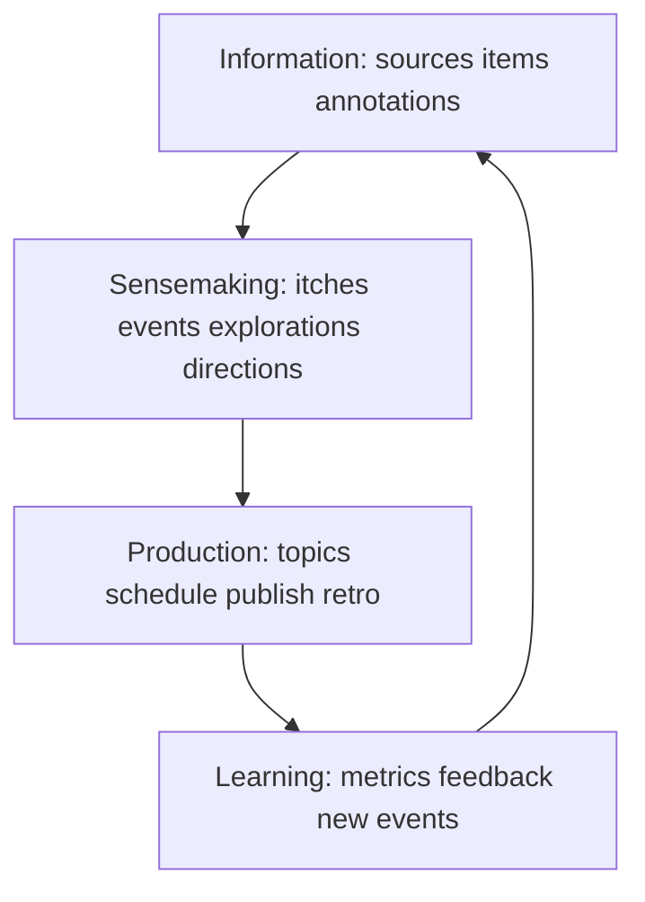

# 心结意义形成层架构

## 分层

## 数据边界

- `itches` 保存心结本体，不保存单一 item 或单一 topic 作为唯一来源。
- `itch_events` 保存每次触发、复现、对话、研究、反馈和状态变化。
- `itch_links` 保存 itch 与 item、annotation、conversation、project、其他 itch 和 topic 等关系；exploration 与 direction 同时用直接外键保留所属关系。
- `explorations` 保存四问、研究问题树、材料地图、反对证据和证据缺口。
- `directions` 保存主张、目标用户、冲突、个人经验连接、证据状态和确认状态。
- `topics` 保持现有生产字段，但增加或通过关系表保留 direction/itch 来源链。

## 运行责任

| 层 | 真正负责什么 | 不负责什么 |
| --- | --- | --- |
| dabaihua | 持久状态、关系、权限、来源链、查询 | 替用户形成判断 |
| Agent | 四问对话、材料研究、冲突提取、方向候选 | 自动确认 direction |
| Deep Research | 来源获取、交叉验证、证据缺口 | 直接产出用户立场 |
| Content/Coding Harness | 消费确认后的 Brief 并生产 | 从文章标题随机生成选题 |
| Wiki | 稳定概念、分析、方法论 | 充当运行时状态数据库 |

## 状态原则

心结生命周期和执行生命周期分离。`researching` 属于 exploration，`scheduled` 属于 topic；心结本身只表示开放、休眠、解决、归档等长期状态。一个心结可以重新激活。

exploration 每一轮独立成行，状态为 `open / researching / synthesized / closed`。direction 初始只能是 `candidate`，之后由显式动作进入 `confirmed / rejected / retired`。候选创建和用户确认不得合并成一个 API 动作。

## 图谱策略

第一版只使用 D1 关系表。图谱查询必须返回关系类型、来源和时间，不能只返回一个相似度分数。等真实数据达到多个心结、多个方向和至少一条反馈链后，再评估是否需要专用图数据库。
