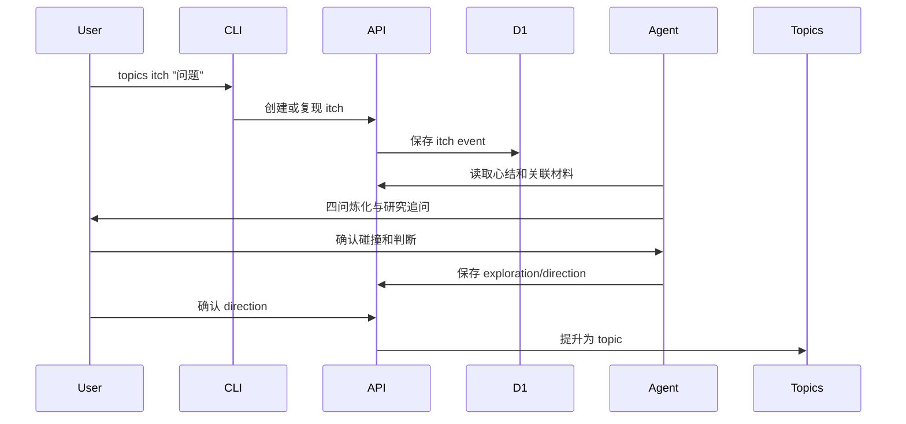

# 心结工作流产品规格

## 定位

qingliu 不只是阅读器或选题看板，而是记录个人问题张力并把它炼化为内容方向的工作台。心结必须像 topic 一样可落库、可查询、可通过 CLI 操作。

## 对象

| 对象 | 含义 | 是否长期存在 |
| --- | --- | --- |
| itch | 长期放不下的母问题 | 是 |
| itch event | 某次生活、项目、阅读、对话或反馈再次触发 | 是，追加 |
| exploration | 一轮反问、研究和材料碰撞 | 是，保留版本 |
| direction | 探索后形成的候选个人判断 | 是，可多个 |
| topic | direction 的一次生产化表达 | 是，进入现有看板 |
| feedback | 发布、实验、评论或复盘产生的证据 | 是，回流 |

## 最小用户链路



## AI 边界

AI 负责追问、问题树、材料地图、证据整理、方向候选和结构化 Brief。AI 不负责制造用户没有的冲动，不把材料摘要冒充用户判断，不直接替用户确认 direction。

## 当前 CLI 闭环

```text
topics itch "问题"
topics itch refine <itch-id> --file exploration.json
topics itch research <itch-id> --exploration <id> --file research.json
topics itch direction <itch-id> --file direction.json
topics itch directions <itch-id>
topics itch confirm <itch-id> --direction <id> --note "用户判断"
```

`exploration.json` 使用 `triggerContext`、`coreConflict`、`personalStake`、`desiredChange` 保存四问。研究产物使用 `questionTree`、`materialMap`、`counterEvidence`、`evidenceGaps`。方向创建接口忽略外部传入的确认状态，只创建 `candidate`；确认必须是后续独立动作。

## 心结 002 初始记录

Loop 到底最后由谁来收敛？Loop 的收敛与 Claude Code Dynamic Workflow 有什么区别？分别怎么用和选择？

这条记录已通过生产 qingliu 正式接口保存为心结 `#2`。当前已有一轮探索、研究问题树、材料地图、反证和两个候选方向；两个方向均未确认，内容生产链路尚未启动。

## 非目标

- 不是抓到文章就自动生成 topic。
- 不是为所有材料打一个更复杂的总分。
- 不是一开始做独立图数据库或复杂可视化。
